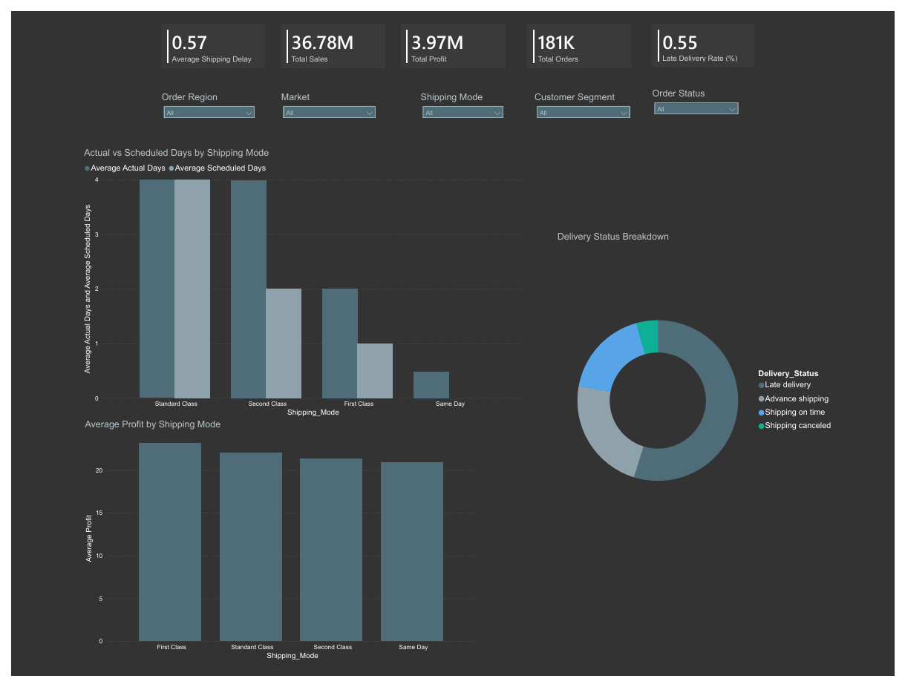

# DataCo-Suppy-Chain-Analysis
End-to-end supply chain analysis using Excel, SQL, and Power BI to identify delivery delays, shipping performance, and profitability insights.

## Objective
Analyze supply chain operations and delivery performance to identify key factors affecting shipping delays, delivery status and profitability.

## Dataset
DataCo SMART Supply Chain for Big Data Analysis

The raw dataset was cleaned and transformed before analysis.
The cleaned dataset used in this project is available in the `data/` folder.

## Tools 
SQLite
DB Browser for SQLite
Microsoft Excel
SQL
Power BI

## Analysis Performed

Data Cleaning
- Cleaned and structured the raw dataset using Microsoft Excel
- Checked for missing values and duplicates
- Standardized column names and date formats
- Validated shipping days and sales values before database import

SQL Data Analysis
- Row count and dataset validation
- Date range analysis
- Null value checks
- Delivery delay calculation
- Profit margin calculation

Business Analysis
- Shipping performance comparison by shipping mode
- Late delivery risk analysis by region
- Profit vs delivery delay relationship

Dashboard Development
- Created an interactive Power BI dashboard
- Added KPI cards for key performance metrics
- Implemented slicers for region, shipping mode, customer segment, market and order status

## Key Insights
- Standard Class and Second Class shipping modes show higher delivery delays compared to other modes
- Same Day shipping demonstrates the best delivery performance
- First Class shipping mode generates higher average profit per order
- Delivery delays vary across regions, indicating operational inefficiencies in certain areas

## Dashboard Preview

## Conclusion
This project demonstrates how SQL analysis combined with Power BI visualization can uncover operational inefficiencies in supply chain systems and support data-driven decision making for logistics optimization.
